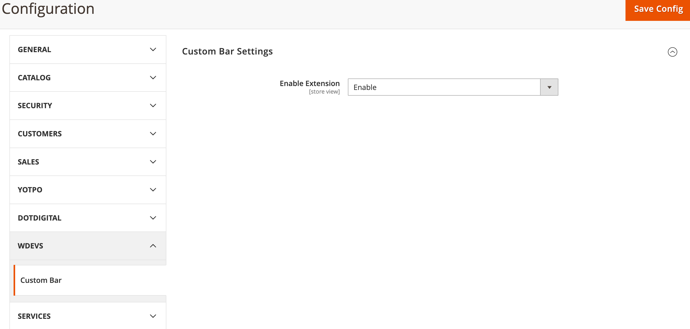

#  Module Wdevs CustomBar

### Task
* The content of this bar must be associated with a customer group when the current visitor is logged in or not. `DONE`
* The content should be different for each customer group. `DONE`
* The module must have an admin option to enable or disable the new feature, it must work with FPC enabled (e.g. Varnish).`DONE`
* It must work in a Luma installation without extra theme customization out of the module, which means that all the files must be inside a folder app/code/WdevsCustomBar. `DONE`

### TODO
* Varnish test
* Code review

### Doc

* To Enable Modules

* To Mange Content according to customer group

